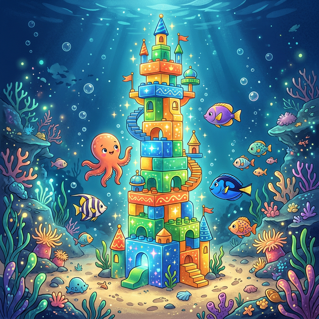

# 🧱 Der Aufbau

Nachdem wir etwas gut verstanden haben, fangen wir an zu bauen!
Das nennt man in Pylovara den **Aufbau**.

(Bild: )

Wir nehmen unsere Teile und bauen etwas Neues. 
Das ist genau wie wenn du mit bunten Bausteinen einen großen, starken Turm baust!

🧱 🧱 🧱
Roter Stein, blauer Stein, grüner Stein... Welchen Baustein legst du ganz nach oben auf die Spitze?
