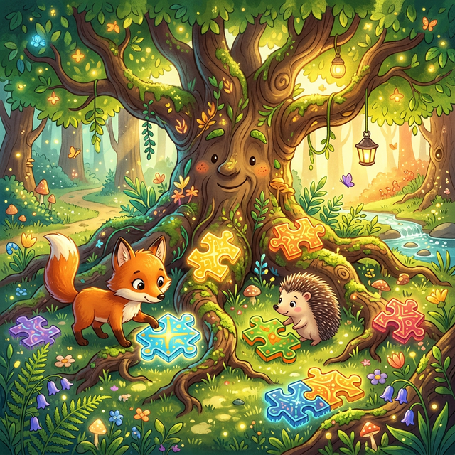

# 🧩 Die Komponenten

Das ist ein langes Wort: Kom-po-nen-ten. 
Aber es ist ganz schwer? Nein, ganz einfach!

(Bild: )

Komponenten sind wie **Puzzleteile**. 
Wenn du viele kleine Puzzleteile richtig zusammensteckst, bekommst du ein großes, schönes Bild.

In Pylovara stecken wir auch viele Teile zusammen. Und jedes Teil hat eine Aufgabe.

🧩 🧩 🧩
**Suchspiel:** Kannst du drei Puzzleteile zählen? Zeichne selbst ein eigenes kleines Puzzleteil in die Luft!
