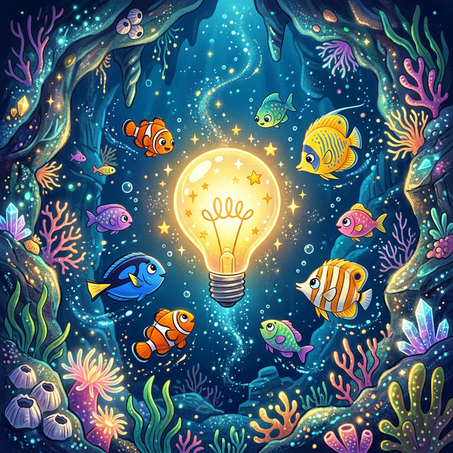

# 💡 Das Verstehen

Weißt du, wie es sich anfühlt, wenn man endlich versteht, wie ein Spiel funktioniert?
Das ist so, als ob oben über dem Kopf eine kleine Lampe angeht! **Pling!**

(Bild: )

In Pylovara nennen wir das: **Das Verstehen**.
Wenn du die Puzzleteile richtig zusammensteckst, verstehst du das große Bild. Alles macht auf einmal Sinn.

💡 💡 💡
**Mach mit:** Male im Kopf eine kleine Sonne um die Lampe, damit sie noch viel heller leuchtet!
