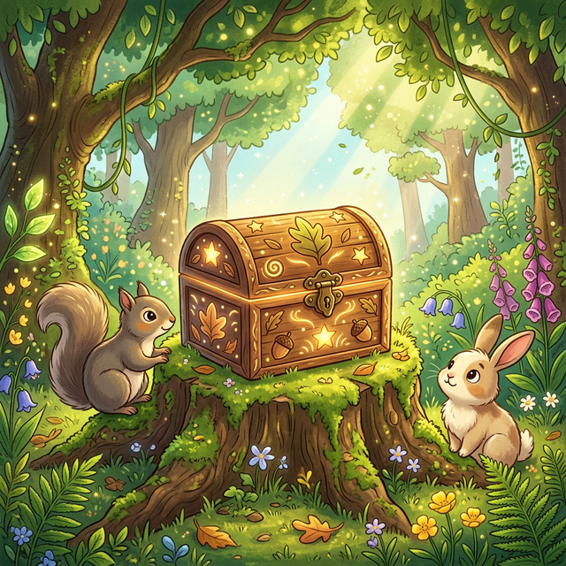

# 📦 Die Boxis

Hallo kleines Helferlein! Das ist **Boxis**! 
Boxis sieht aus wie eine schlaue, sehr ordentliche Kiste.

(Bild: )

Alles, was wichtig ist, heben wir gut und sicher in Boxis auf.
Boxis passt sehr gut auf alle deine Puzzleteile und Muster auf, damit bloß nichts verloren geht.
Boxis ist ein richtig guter Helfer in der Pylovara-Welt.

📦 ✨
Wenn du etwas Wichtiges suchen möchtest oder gut aufheben willst, dann frag Boxis!
