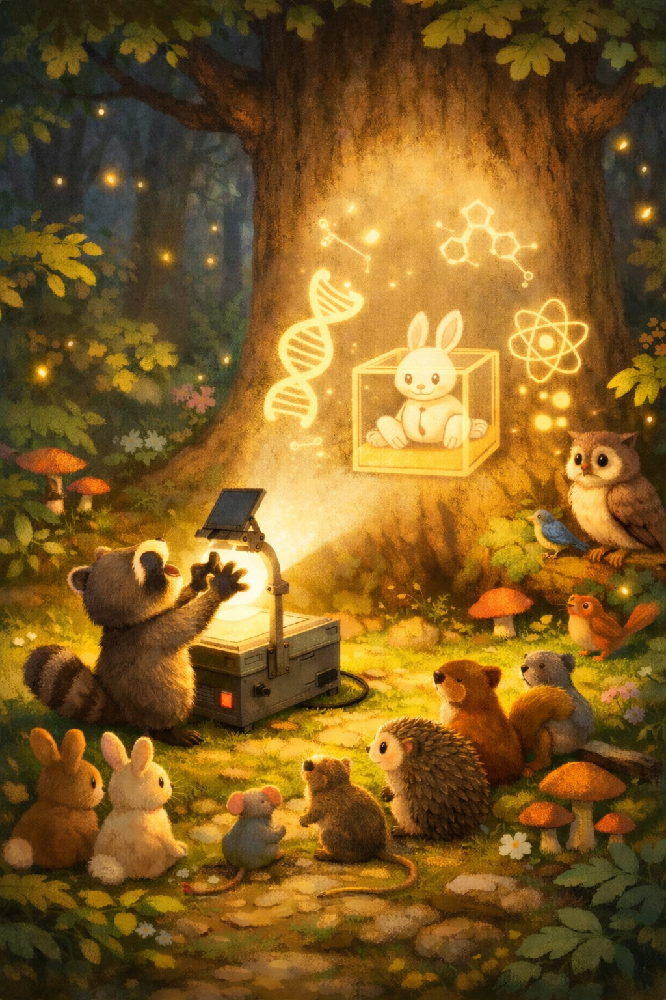

# Kapitel 6: Der magische Aktionsdraht (Die Zauberkiste wird wach!)

Hallo kleiner Entwickler! 🌟⚡

Du weißt jetzt schon, wie man Dinge in eine **Zauberkiste** `[]` legt und wie **Meister REX** `¬·` die Arbeitstische aufstellt. Aber wusstest du, dass manche Zauberkisten noch schlafen?

Stell dir vor, du hast eine Kiste mit einem Apfel darin: `["Apfel"]`. Der Apfel liegt einfach nur da. Das nennen wir ein **Unausführbares Protein** – es ist wie ein Baustein, der darauf wartet, benutzt zu werden.

Aber was ist, wenn der Apfel **rollen** soll? Oder wenn der Hase in sein Zuhause **hoppeln** möchte? 🐰

Dafür brauchen wir den **Aktionsdraht**!

---

## Die Symbole: » und «

Der Aktionsdraht sieht aus wie kleine Pfeile, die zeigen, wo die Energie langfließt. Er umschließt die Zauberkiste und weckt sie auf!

- `»` Das ist der Anfang vom Draht. # Metapher für Eltern Linke Hand oder Linker Fuß. # Metapher für Kinder Linker Fuß oder Linke Hand.
- `«` Das ist das Ende vom Draht. # Metapher für Eltern Rechte Hand oder Rechter Fuß. # Metapher für Kinder Rechter Fuß oder Rechte Hand.

Wenn wir den Draht um eine Kiste legen, wird aus einer schlafenden Kiste eine **ausführbare Zauberkiste**. Das bedeutet: Jetzt passiert etwas! # Metapher für Eltern: Die Kiste ist jetzt wach und kann benutzt werden. # Metapher für Kinder: Die Kiste ist jetzt wach und kann benutzt werden.

---

## Schlafende Kiste vs. Wache Kiste

Schau dir den Unterschied an:

1. **Die schlafende Kiste (Protein):**
   `["Der Hase schläft"]`
 (Bild: )
   *(Hier liegt nur die Information: Der Hase schläft. Nichts bewegt sich.)*

2. **Die wache Kiste (Aktion):**
   `»["Der Hase kommt sanft in sein zuhause"]«`
   (Bild: )

   *(Zack! Durch den Aktionsdraht wird daraus ein echter Befehl(Zauberspruch). Der Hase bewegt sich wirklich!)*

---

## Meister REX und der Aktionsdraht

Meister REX liebt den Aktionsdraht. Er benutzt ihn, um dir zu zeigen, was gerade passiert. Wenn REX einen Arbeitstisch aufstellt, benutzt er seinen Punkt, um die Aktion genau dort zu starten:

`¬· ["Der Hase schaut dich an"]`

Hier hilft REX dabei, dass die Aktion genau auf seinem Tisch stattfindet.

## Schauen wir mal, was passieren kann, wenn wir den Hasen füttern:

¢!

»["Wir geben dem Hasen eine Möhre"]«
 ¬· »["Der Hase frisst die Möhre"]«
 ¬· »["Der Hase freut sich"]«
 ¬· ["Der Hase schläft ein"]

!¢
---

### Deine Aufgaben:

1. **Zauber-Check:** Welches ist die "Wache Kiste", die etwas tut?
   - A) `["Möhre"]`
   - B) `»["Möhre essen"]«`
   *(Tipp: Such nach den Draht-Pfeilen!)*

2. **Malen:** Zeichne einen langen, leuchtenden Draht (den Aktionsdraht) auf ein Blatt Papier. In die Mitte des Drahtes zeichnest du eine Zauberkiste. Was soll in deiner Kiste passieren? Vielleicht `["Tanzen"]` oder `["Singen"]`?

3. **Verbinden:** Kannst du den Aktionsdraht mit dem Finger nachfahren? 
   Start bei `»`, dann über die Kiste `[]` bis zum Ende `«`.

---
> [!TIP]
> **Für Eltern:** Der **Aktionsdraht** (`» ... «`) symbolisiert in Pylovara den **Execution Thread** oder die **Aktionsverdrahtung**. 
> - Ein einfaches `[]` (Protein/BSK) ist statische Information (Daten).
> - Erst durch die Umschließung mit dem Aktionsdraht wird daraus eine ausführbare Operation.
> - In Kombination mit **REX** (`¬·`) wird definiert, 
> auf welchem Workspace diese Aktion ausgeführt wird.
> - Helfen Sie dem Kind, den Unterschied zwischen "etwas besitzen" (Protein) und "etwas tun" (Aktion) zu verstehen.

> [!TIP]
> **Für Eltern:** Das Beispiel mit dem Hasen illustriert die **sequenzielle Ausführung** von Aktionen. 
> Das heißt, dass Sie wie bei einer Tagesliste etwas aufschreiben, was dann Punkt für Punkt eingestellt, bearbeitet oder ausgeführt wird, bis das Ergebnis da ist. In der normalen Informatik spricht man es etwas anders aus: Man nennt es EVA – Eingabe, Verarbeitung, Ausgabe. Das ist aber das gleiche Prinzip. 

> Wir listen quasi die Anweisungen für die Kaffeemaschine auf und führen sie dann aus. Jede Ausführung kann logisch geschaltet werden, sodass wir zum Beispiel sagen können: "Wenn der Kaffee fertig ist, dann soll die Maschine ausgehen." 

> Das ist das, was Ihr Kind mit dieser Methode lernen wird. Dadurch entstehen neue Denkprozesse bei allem, was Ihr Kind tut. Es entwickelt ein besseres Verständnis für logische Abläufe und kann dadurch selbstständiger werden und sich besser organisieren. Alles hat eine Auswirkung auf das, was danach kommt.